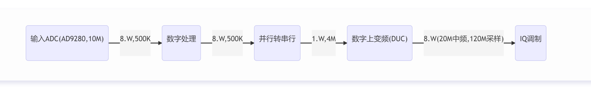
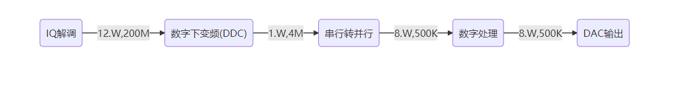
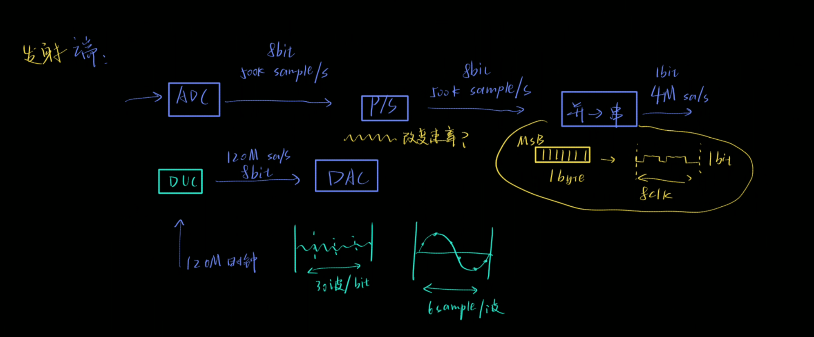
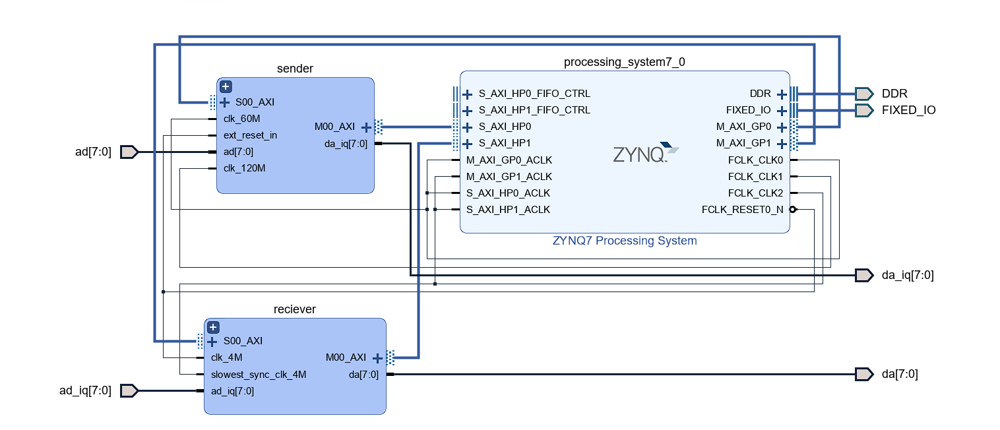
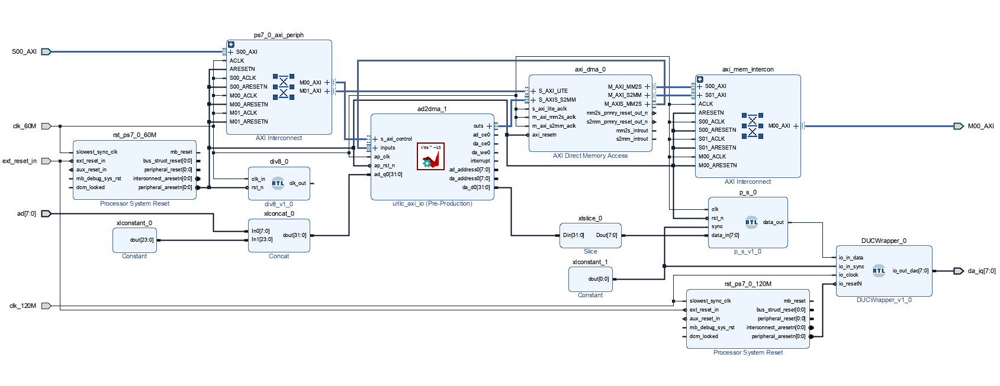
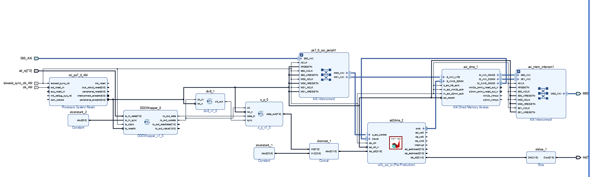

# urllc-demo-pynq
Ultra Reliable Low Latency Communication demo for pynq.

[toc]

## Plan

### 初步整体框架

### FPGA部分

1. 发送端
     - [ ] 按照对应频率用ADC采样
     - [ ] 经过FPGA内部流数据处理函数
     - [ ] 添加帧同步、时钟同步
     - [ ] 到达IQ调制，输出数据部分
     
2. 接收端
     - [ ] 从IQ解调，用ADC采样到的波形数据
     - [ ] 根据帧同步和时钟同步信息对ADC采集的数据进行时间上的调整（频偏等）
     - [ ] 模拟波形数据→数据波形
     - [ ] 传输到DAC
### FPGA框图

#### 发送端

#### 接收端

**关于采样率等：**

### 数字上变频DUC&&下变频DDC

1. 数字上变频和数字下变频 == 正交IQ调制和正交IQ解调。他们本来就是IQ调制解调用的，只不过我们这里BPSK只利用了I路。

   简单来说，数字上变频就是先把比特流变成双极性的，在数字域中将双极性比特流信号与中频的正弦波**相乘**（也就是简单的数字相乘），之后通过DAC输出即可获得中频的BPSK调制信号。

   数字下变频与上变频同理，将模拟混频获得的中频模拟信号转化至数字域，再将其与中频正弦波在数字域中相乘，根据相乘后的结果做出0/1的判断。具体的0/1判断可以用门限或者用滑动窗，还有很多其他的方法。

2. 中频$f_{IF}=20MHz$

   1. 如果使用所有最高ADC速率，则需要储存25个点的$\sin$数据，分配到4个波形中。

      $T_{Sample}=\frac{1}{125M}s=\frac{1}{1.25\times 10^{8}}s,n=1.25\times 10^{8}$

      $X(t) = x(t) \cdot \sin(2.5\pi\times 10^{15})$

   2. 如果只使用120M，则需要储存6个点的$\sin$数据，每个波形的点一致

      $T_{Sample}=\frac{1}{120M}s,n=1.2\times 10^{8}$

      $X(t)=x(t)\cdot \sin(2.4\pi \times 10^{15})$

   3. 二者对比：

      

      

### 时钟同步

采样频率保持一致的情况下，采样点在发射端和接收端有可能不同。最终表现出来的数字域结果为相位偏移。

### 帧同步

发射端PYNQ生成一个同步信号，指示帧的开始。在通过有线方式传输到接收端后，经过一定时延，即可获得接收端PYNQ的帧同步信号。保证采样点的开始与帧同步信号对齐。

该时延在系统初始化时完成，在发射端发送一个冲激信号，帧同步信号无时延直接接入接收端PYNQ，计算接收冲激信号与发射信号的延时。

### 技术指标等

1.	源信号假设为语音信号，带宽30Hz~3.4KHz。此处选取5KHz单频正弦信号。
2.	8Bit-ADC——AD9280 65MSPS max
    - 采样率10M Sample/s = 80Mbits/s。
    - 无信源编码，直接线性采样。
3.	比特流输入至PYNQ进行处理，每200Bts为一帧进行传输，则采样一帧所需时间10us。
    - 不考虑任何协议与信道编码。包长即为200Bits
    - 实现流传输，速率500kBits/s
4.	数字上变频——PYNQ进行数字信号处理。
    - 比特流→中频20MHz的BPSK信号
    - 8Bit-DAC输出模拟中频信号，更新速率125M Sample/s——AD9708
5.	模拟上混频——混频器ADE-1
    - 本振LO：220MHz——ADF4351 PLL
    - 低通滤波器LPF：过渡带210MHz~230MHz，纹波1dB，阻带40dB——7阶椭圆滤波
6.	功放及其驱动：OPA695（0~10dB）+THS3091（20dB）
7.	低噪放MAR-8ASM+（60dB）+AD驱动放大OPA695（20dB）
8.	模拟下混频
    - 本振LO：220MHz——与5中上混频使用同一个PLL。不考虑因时延可能造成的相位模糊，利用差分编码性质将错误降低为1
9.	8Bit-ADC——AD9280 65MSPS max
    - 实现流传输
    - 数字下变频：中频20MHzBPSK→比特流
	- 帧同步：发射端PYNQ通过有线形成传输触发信号
	- 时钟同步：使用同一本振源，保证频率相同。在保证帧同步精确率后，对齐帧开始信号与采样时钟实现相位同步。
10.	8Bit-DAC输出——AD9708更新速率125M Sample/s
    - 经过低通滤波获得原始信号——有源和无源滤波器可能带来增益影响，待解决。

## TODO-List

- [x] ~~Vitis HLS IP~~
    - [x] Create: ad-da(1/1)
    - [x] debug: AXI Stream DMA
    - [x] 弃用
- [ ] 数字上变频和下变频
    - [x] Chisel(1/2)
    - [x] debug: 调试Chisel模块
      - [x] Frame Trigger
      - [x] DUC
      - [ ] DDC
- [ ] 时钟同步问题
    - [ ] 调试同步sync
    - [ ] 添加异步sync
    - [ ] 调试异步sync
- [ ] Vitis 嵌入式
    - [x] 所有模块的单元测试
    - [x] DMA LOOP Test
    - [ ] Flash程序固化
- [ ] PYNQ Module
    - [ ] PYNQ 网络问题
    - [ ] PYNQ模块单元测试
- [ ] 联调
    - [x] Sender调试

## Debug Logs

1. 2022年1月13日22:53:10

   1. 架构图

2. 2022年1月3日17:12:12

   1. 架构图

      

      发送端：

      

      接收端：

      

3. 2022年1月29日07点25分

    1. 核心部分架构图

      [urllc_fifo_core.pdf](./urllc-vivado/urllc_fifo_core.pdf)
    
4. 2022年2月3日16点15分 [version 0.3 (urllc-fifo)]

    1. GPIO1：参数设置

        | counter trigger | divider DAC | divider ADC |
        | --------------- | ----------- | ----------- |
        | [31:16]         | [15:8]      | [7:0]       |

    2. GPIO2：开关设置

        | 0    | trigger clear    |
        | ---- | ---------------- |
        | 1    | FIFO write start |
        | 2    | FIFO read start  |
        | 3    | psclk            |
        | 4    | psen             |
        | 5    | psincdec         |
        | 6    | DUC sync         |
        | 7    | function out     |
        | 8    | DDC sync         |
        | 9    | function in      |
        
    3. 外部中断

        | 61   | trigger out   |
        | ---- | ------------- |
        | 62   | mm2s intr out |
        | 63   | s2mm intr out |

    4. 发送端流程

        1. 初始化
            - 设置输入输出数据router = 0，sender = 0; receiver = 1
            - 暂时不使用sync: DUC sync = 1; DDC sync = 1
            - 设置输入数据=>FIFO的divider（ADC divider & DAC divider）
              - ADC：60M总线频率500k，div = 120
              - DAC：60M总线频率4M，div = 15
            - 设置counter trigger
              - target = (MTU / 8)
            - 设置外部中断
              - 中断号：61
              - 触发类型：上升沿
              - 当中断触发时：开始DMA读写
            - // 清空FIFO（触发一次中断）
              - counter trigger clear = 1
              - 开始一次DMA读(写)
              - counter trigger clear = 0
        2. LOOP
            - 等待中断触发
            - 等待DMA发送&接收完毕
            - 处理数据：
              - map(dst) => dst
              - 并行数据转串行：dst[target] => src[target * 8]

    5. 接收端流程

        1. 初始化
           - 设置输入输出数据router = 1，sender = 0; receiver = 1
           - 暂时不使用sync: DUC sync = 1; DDC sync = 1
           - 设置输入数据=>FIFO的divider（ADC divider & DAC divider）
             - ADC：60M总线频率4M，div = 15
             - DAC：60M总线频率500k，div =120
           - 设置counter trigger
             - target = MTU
           - 设置外部中断
             - 中断号：61
             - 触发类型：上升沿
             - 当中断触发时：开始DMA读写
           - // 清空FIFO（触发一次中断）
             - counter trigger clear = 1
             - 开始一次DMA读(写)
             - counter trigger clear = 0
        2. LOOP
           - 等待中断触发
           - 等待DMA发送&接收完毕
           - 处理数据：
             - 并行数据转串行：dst[target] => src[target / 8]
             - map(dst) => dst

